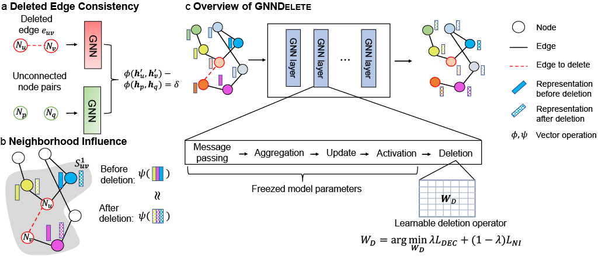

# GNNDelete: A General Unlearning Strategy for Graph Neural Networks

#### Authors: 
- [Jiali Cheng]() (jiali.cheng.ccnr@gmail.com)
- [George Dasoulas](https://gdasoulas.github.io/) (george.dasoulas1@gmail.com)
- [Huan He](https://github.com/mims-harvard/Raindrop) (huan_he@hms.harvard.edu)
- [Chirag Agarwal](https://chirag126.github.io/) (chiragagarwall12@gmail.com)
- [Marinka Zitnik](https://zitniklab.hms.harvard.edu/) (marinka@hms.harvard.edu)

#### [Project website](https://zitniklab.hms.harvard.edu/projects/GNNDelete/)

#### GNNDelete Paper: [ICLR 2023](https://openreview.net/forum?id=X9yCkmT5Qrl), [Preprint]()


## Overview 

This repository contains the code to preprocess datasets, train GNN models, and perform data deletion on trained GNN models for manuscript *GNNDelete: A General Graph Unlearning Strategy*. We propose GNNDelete, a model-agnostic layer-wise operator that optimize both properties for unlearning tasks. It formalizes the required properties for graph unlearning in the form of Deleted Edge Consistency and Neighborhood Influence. GNNDelete updates latent representations to delete nodes and edges from the model while keeping the rest of the learned knowledge intact. 

<p align="center">
    
</p>


## Key idea of GNNDelete

To unlearn information from a trained GNN, its influence on both GNN model weights as well as on representations of neighbors in the graph must be deleted from the model. However, existing methods using retraining and weight modification either degrade model weights shared across all nodes or are ineffective because of strong dependency of deleted edges on their local graph neighborhood. 

Our model formulates the unlearning problem as a representation learning task. It formalizes the required properties for graph unlearning in the form of Deleted Edge Consistency and Neighborhood Influence. GNNDelete updates latent representations to delete nodes and edges from the model while keeping the rest of the learned knowledge intact. 

**Overview of GNNDelete approach.** Our model extends the standard (Msg, Agg, Upd) GNN framework into (Msg, Agg, Upd, Del). Upon unlearning, GNNDelete inserts trainable deletion operators after the GNN layers. The **Del** operator updates the node representations of the affected nodes of deletion (based on the local enclosing subgraph of the deleted information). The updated representations are optimized to meet objectives of **Deleted Edge Consistency** and **Neighborhood Influence**. We only train the deletion operators, while freezing the rest of the GNN weights.


## Datasets

We prepared seven commonly used datasets of different scales, including homogenous and heterogeneous graphs.

Please run the following command to do train-test split and sample deleted information (Two strategies are described in the paper).
```
python prepare_dataset.py
```

The following table summarizes the statistics of all these seven datasets:
| Dataset    | # Nodes |  # Edges  | # Unique edge types | Max # deleted edges |
|------------|:-------:|:---------:|:-------------------:|:-------------------:|
| Cora       |  19,793 |  126,842  |         N/A         |        6,342        |
| PubMed     |  19,717 |   88,648  |         N/A         |        4,432        |
| DBLP       |  17,716 |  105,734  |         N/A         |        5,286        |
| CS         |  18,333 |  163,788  |         N/A         |        8,189        |
| OGB-Collab | 235,368 | 1,285,465 |         N/A         |       117,905       |
| WordNet18  |  40,943 |  151,442  |          18         |        7,072        |
| BioKG      |  93,773 | 5,088,434 |          51         |       127,210       |


## Experimental setups

We evaluated our model in three unlearning tasks and in comparison with six baselines. The baselines include three state-of-the-art models designed for graph unlearning (GraphEraser, GraphEditor, Certified Graph Unlearning) and three general unlearning method (retraining, gradient ascent, Descent-to-Delete). The three different unlearning tasks are:

**Unlearning task 1: delete edges.** We delete a set of edges from a trained GNN model. 

**Unlearning task 2: delete nodes.** We delete a set of nodes from a trained GNN model. 

**Unlearning task 3: delete node features.** We delete the node features of a set of nodes from a trained GNN model. 

The deleted information can be sampled with two different strategies:

**A simpler setting: Out setting** The deleted information is sampled from **outside** the enclosing subgraph of test set.

**A harder setting: In setting** The deleted information is sampled from **within** the enclosing subgraph of test set.


## Requirements

GNNDelete has been tested using Python >=3.6.

Please install the required packages by running

```
pip install -r requirements.txt
```


## Running the code

**Train GNN** The first step is to train a GNN model, on either link prediction or node classification

```python train_gnn.py```

Or

```python train_node_classification.py```

**Train Membership Inference attacker (_Optional_)** We use the model in _Membership Inference Attack on Graph Neural Networks_ as our MI model. Please refer to the [official implementation](https://github.com/iyempissy/rebMIGraph).

**Unlearn** Then we can delete information from the trained GNN model. Based on what you want to delete, run one of the three scrips

To unlearn edges, please run
```
python delete_gnn.py
```

To unlearn nodes, please run
```
python delete_nodes.py
```

To unlearn node features, please run
```
python delete_node_feature.py
```


**Baselines** 
We compare GNNDelete to several baselines
- Retraining from scratch, please run the above unlearning scripts with `--unlearning_method retrain`
- Gradient ascent, please run the above unlearning scripts with `--unlearning_method gradient_ascent`
- Descent-to-Delete, please run the above unlearning scripts with `--unlearning_method descent_to_delete`
- GraphEditor, please run the above unlearning scripts with `--unlearning_method graph_editor`
- GraphEraser, please refer to the [official implementation](https://github.com/MinChen00/Graph-Unlearning)
- Certified Graph Unlearning, please refer to the [official implementation](https://github.com/thupchnsky/sgc_unlearn)


## Citation

If you find *GNNDelete* useful for your research, please consider citing this paper:

```
@inproceedings{cheng2023gnndelete,
title={{GNND}elete: A General Unlearning Strategy for Graph Neural Networks},
author={Jiali Cheng and George Dasoulas and Huan He and Chirag Agarwal and Marinka Zitnik},
booktitle={International Conference on Learning Representations},
year={2023},
url={https://openreview.net/forum?id=X9yCkmT5Qrl}
}
```


## Miscellaneous

Please send any questions you might have about the code and/or the algorithm to <jiali.cheng.ccnr@gmail.com>. 


## License

GNNDelete codebase is released under the MIT license.
